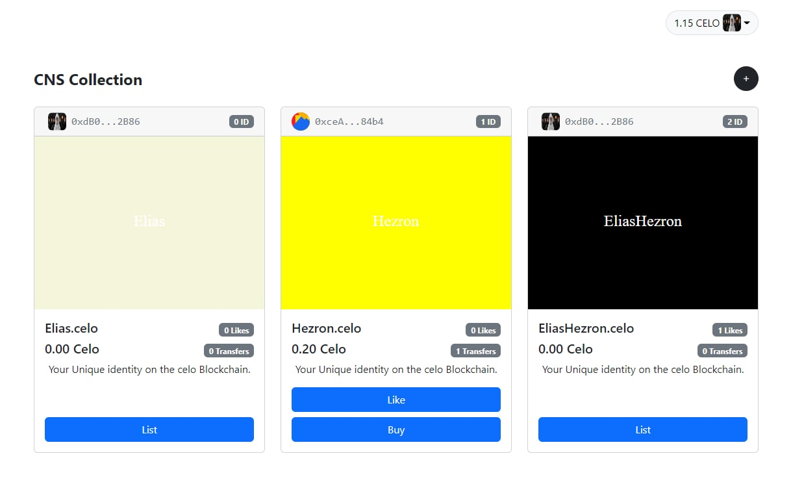

# CELO NAME SERVICE MARKETPLACE

## Description

This is an CELO blockchain Name service and market place that allows users reserve, select background color of the nft, list and sell there favorite names. basically names are sold as nfts. Its like a domain service but for the celo blockchain. the concept is inspired by the ENS(ethereum name service).
the smart contract to the appliccation is located [here](https://alfajores-blockscout.celo-testnet.org/address/0x2414B85dd15C9163Fff848D8dD3748607084B677/transactions)
The MarketPlace allows users to customazise their Avicon/profile picture, reserve a name, like various names, however this can only be done once. Purchasing already reserved names using the native celo currency (CELO) and token transfer upon purchase.

Home page UI design inspired [Heizal](https://github.com/Heizal)

## Technologies Used

- [WEB3.storage] (https://web3.storage)
- [REACT](https://reactjs.org)
- [HARDHAT](https://hardhat.org)
- celo [Alphajores](https://alfajores-blockscout.celo-testnet.org/) testnet

## TODO

- customize your profile pitcure using
- reserve your name
- select background color
- list your nft
- like somelse's NFT
- buy another NFT

## Live Demo

Checkout the Live Demo Of the Project Hear [CELO NAME SERVICE](https://still-sound-3479.on.fleek.co/)

## Usage

### Requirements

1. Install the Metamask wallet/ celo wallet
2. Create a wallet.
3. get some [Celo Faucet](https://celo.org/developers/faucet) and get tokens for the alfajores testnet.
4. Mint your NFT/ reserve a name
